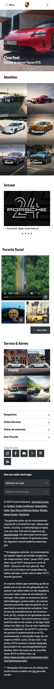
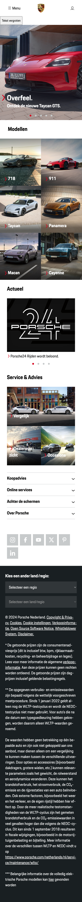

# Procesverslag
Markdown is een simpele manier om HTML te schrijven.
Markdown cheat cheet: [Hulp bij het schrijven van Markdown](https://github.com/adam-p/markdown-here/wiki/Markdown-Cheatsheet).

Nb. De standaardstructuur en de spartaanse opmaak van de README.md zijn helemaal prima. Het gaat om de inhoud van je procesverslag. Besteedt de tijd voor pracht en praal aan je website.

Nb. Door *open* toe te voegen aan een *details* element kun je deze standaard open zetten. Fijn om dat steeds voor de relevante stuk(ken) te doen.

## Wie ben ik?

  
Uitwerken voor kick-off werkgroep

  ### Auteur:
  Esmae Grapendaal

  #### Je startniveau:
  Blauw/Rood

  #### Je focus:
  Surface plane

## Je website

  
Uitwerken voor kick-off werkgroep

  ### Je opdracht:
  Voor mijn opdracht wil ik de website van [Porsche Nederland](https://www.porsche.com/netherlands/nl/ "Porsche Nederland") maken.

  #### Screenshot(s) van de eerste pagina (small screen): 
  [Home | Porsche Nederland](https://www.porsche.com/netherlands/nl/ "Porsche's Homepage")
  

  #### Screenshot(s) van de tweede pagina (small screen):
  [Porsche24. | Porsche Nederland](https://www.porsche.com/netherlands/nl/motorsportandevents/porsche24/ "Porsche24. pagina")
  

## Toegankelijkheidstest 1/2 (week 1)

  
Uitwerken na test in 2e werkgroep

  ### Lijst met bevindingen
  #### Screenreader test:
  - **Kopstructuur:**
    - Koppen van niveau 1 en 2 worden goed voorgelezen met niveau-aanduiding, wat storend kan zijn als dit meerdere keren wordt herhaald.
    - Footer-koppen worden niet herkend door de screenreader, omdat deze als `
` in plaats van bijvoorbeeld `<h4>` zijn geschreven.
  - **Linkbeschrijvingen:**
    - Niet alle links geven duidelijk aan waar ze naartoe leiden, vooral in de hero-sectie.

  #### WCAG checklist:
  - **Content**
      - Gebruik van eenvoudige taal en unieke, beschrijvende content voor knoppen en links is goed.
  - **Globale Code:**
      - HTML is gevalideerd en heeft wat info, warning en errors.
      - Heeft een unieke titel voor elke pagina en het gebruik van een lang-attribuut.
  - Toetsenbordnavigatie:
      - Navigatie-elementen hebben zichtbare focusstijlen en de focusvolgorde komt overeen met de visuele lay-out.
  - **Mobiel en Touch:**
      - Website ondersteunt oriëntatierotatie en vermijdt horizontaal scrollen.
      - Interactieve elementen zijn goed gepositioneerd en gemakkelijk te activeren.
  - **Koppen**
      - Koppen zijn logisch en volgen een juiste hiërarchie, maar footer-items worden niet als koppen herkend.
  - **Lijsten**
      - Lijstinhoud maakt correct gebruik van lijst-elementen zoals `<ul>` en `<ol>`.
  - **Afbeeldingen**
      - Afbeeldingen hebben een alt-attribuut, maar afbeeldingen met tekst missen een volledige beschrijving.
      - Decoratieve afbeeldingen gebruiken correct een lege alt.
  - **Media (Video & Audio)**
      - Media speelt automatisch af, er is wel een mogelijkheid om te pauzeren.
      - Er zijn geen video-onderschriften of audio-transcripties beschikbaar.
  - **Controls**
      - Links en knoppen zijn herkenbaar en hebben een focusstijl.
      - Skip-links zijn niet duidelijk zichtbaar.
  - **Uiterlijk**
      - Ondersteuning voor dark mode en high-contrast mode ontbreekt. Wel via de Chrome accessibility. 
      - Tekst kan worden vergroot tot 200% zonder problemen.
  - **Animaties**
      - Animaties blijven actief, zelfs als reduced-motion is ingeschakeld.
  - **Kleurcontrast**
      - Contrasten zijn over het algemeen goed, maar witte tekst op een witte achtergrond is soms moeilijk leesbaar. Dit is bij sommige afbeeldingen.

## Breakdownschets (week 1)

  
Uitwerken na afloop 3e werkgroep

  ### De hele pagina:
  
  
  (Gemaakt in week 1)

  ### Dynamisch deel (bijv menu): 
  

## Voortgang 1 (week 2)

  
Uitwerken voor 1e voortgang

  ### Stand van zaken
  Hier dit ging goed & dit was lastig (neem ook screenshots op van delen van je website en code)

  #### Wat ging goed?
  Om de basis op te stellen van de HTML en CSS ging goed.

  #### Wat was lastig?
  Ik vond het lastig om een begin te maken met de carrousels/sliders, omdat je hier Javascript moet gaan gebruiken.

  ### Agenda voor meeting
  | Esmae | student 2 | student 3 | student 4 |
  | --- | --- | --- | --- |
  | Carrousel slider | en dit | en ik dit | en dan ik dat |
  | en dat ook nog | dit als er tijd is | nog een punt | dit wil ik zeker |
  | ... | ... | ... | ... |

  ### Verslag van meeting
  - Maak de H1 onzichtbaar met visibility hidden op de home pagina
  - Voor een article > Eerst een h5, p, img, button. Verander de volgorde met order in de css. Zo blijft alles hetzelfde in de html maar met de styling wordt het veranderd.
  - In de Hero wordt de heading een h3 en dan een hidden h2
  - Voor de carousel worden de items in een ul gezet
  - HR wordt gewoon border-top en border-bottom
  - Footer h4 worden h3 en dan ook weer een hidden h2
  - Voor de accordeon gebruik je details en summary
  - Social media links worden een flex ipv grid

## Voortgang 2 (week 3)

  
Uitwerken voor 2e voortgang

  ### Stand van zaken
  Hier dit ging goed & dit was lastig (neem ook screenshots op van delen van je website en code)

  #### Wat ging goed?
  - **Afbeeldingen en tekst combineren zonder `background-image`** 
    Soms zijn er afbeeldingen met tekst, hiervoor kon ik geen `background-image` gebruiken vanwege toegankelijkheid. Hiervoor moest je `position` gebruiken om de tekst over de `img` te zetten.

  #### Wat was lastig?
  - **Logo centreren in de header** 
    Ik kon maar het logo niet precies in het midden krijgen. Ik heb hiervoor `flex` moeten gebruiken om het logo een soort stretch te geven, maar dat de buitenste elementen wel tegen de rand blijven staan.
  - **Hero carrousel maken** 
  Hiervoor heb ik een code kunnen gebruiken van Sanne. Ik heb wel gekeken naar de code zodat ik wel begrijp wat alles betekent. Ik vind het Javascript gedeelte wel nog lastig om helemaal te begrijpen.

  ### Agenda voor meeting
  samen met je groepje opstellen

  | Esmae | student 2 | student 3 | student 4 |
  | --- | --- | --- | --- |
  | Eigen tekst per slide bij home pagina (Hero) | en dit | en ik dit | en dan ik dat |
  | Navigatie bij Porsche24 pagina | nog een punt | dit wil ik zeker |
  | Andere soort slider bij Porsche24 pagina | ... | ... | ... |

  ### Verslag van meeting
  - Bronnen bij de Readme zetten!!!
  - Header code aanpassen (simpeler maken)
  - Position relative op de li voor de home hero slider

## Toegankelijkheidstest 2/2 (week 4)

  
Uitwerken na test in 9e werkgroep

  ### Bevindingen
  Lijst met je bevindingen die in de test naar voren kwamen (geef ook aan wat er verbeterd is):

  (Toegankelijkheidstest als laatste gedaan)
  - Menu wordt gelijk meegepakt (niet handig gedaan, weet niet hoe ik dit kan oplossen)
  - Alle elementen worden nu opgenoemd, dat is erg vervelend.

  #### WCAG checklist:
  - **Uiterlijk**
      - Dark mode wordt nu ondersteund
      - Tekstgrootte wordt nu ondersteund (niet alle tekst gedaan, paar headings en p's gedaan).
  - **Animaties**
      - Animaties zijn nu uitgeschakeld als reduced-motion is ingeschakeld.

## Voortgang 3 (week 4)

  
Uitwerken voor 3e voortgang

  ### Stand van zaken
  hier dit ging goed & dit was lastig (neem ook screenshots op van delen van je website en code)

  #### Wat ging goed?
  - **Styling bij de home pagina** 
    Omdat Porsche een vrij minimalistische vormgeving heeft, is het makkelijk om de styling na te maken.

  #### Wat was lastig?
  - **Tweede carrousel maken** 
  Ik vond het lastig om dit voor elkaar te krijgen. Ik heb het gevraagd tijdens een werkgroep. Zij zeiden dat ik de codes eigenlijk moest kopiëren en dan een "2" bij elke function etc. kon zetten. Dit heb ik gedaan en toen kon ik het wel werkend laten maken. Wat ik ook bij de vorige voortgang had gezegd heb ik nog steeds wel: Ik heb wel gekeken naar de code zodat ik wel begrijp wat alles betekent. Ik vind het Javascript gedeelte wel nog lastig om helemaal te begrijpen.

  ### Agenda voor meeting
  samen met je groepje opstellen

  | Esmae | student 2 | student 3 | student 4 |
  | --- | --- | --- | --- |
  | Surface plane items bespreken | en dit | en ik dit | en dan ik dat |
  | Navigatie bij Porsche24 pagina | nog een punt | dit wil ik zeker |
  | Hamburger menu tweede pagina | ... | ... | ... |

  ### Verslag van meeting
  hier na afloop snel de uitkomsten van de meeting vastleggen

  - Maak menu tweede pagina wel sticky en dan nog niet dat het veranderd
  - Maak een nieuwe javascript aan voor menu tweede pagina
  - Surface plane onderdelen zijn goed
  - Met video/geluid wel wat leuks doen > denk aan: een knop indrukken en dan een geluidje > dit is al beter dan een regel html met video en src

## Eindgesprek (week 5)

  
Uitwerken voor eindgesprek

  ### Je uitkomst - karakteristiek screenshots:

  Uitkomst home pagina:

  

  Uitkomst Porsche24 pagina:

  

  ### Dit ging goed/Heb ik geleerd: 

  
  
  Ik heb geleerd hoe ik een carrousel kan maken, ik heb meerdere soorten gemaakt ook nog twee op de Porsche24 pagina (zie hieronder).
  
  

  ### Dit was lastig/Is niet gelukt:

  

  Ik vond het erg lastig om een video te koppelen met JavaScript button. Ik heb nu alleen afspelen en pauzeren kunnen doen. En het stijlen van de video wat niet gelukt helaas. (Hierboven zie je hoe het op de Porsche webiste is en hieronder hoe ik het heb).

  

## Bronnenlijst

  1. [Bron voor carrousels](https://codepen.io/shooft/pen/yLKjzWa)
  2. [Bron voor placeholder select veld](https://aurisecreative.com/blog/2023/10/how-to-add-a-placeholder-to-a-select-field/)
  3. [Bron voor hamburger menu](https://codepen.io/shooft/pen/VwJXNEg)
  4. [Bron voor scroll-margin-top](https://developer.mozilla.org/en-US/docs/Web/CSS/scroll-margin-top)
  5. ChatGPT prompt: "Kan je ook bepaalde functions creeren op bepaalde pagina's met javascript? Ik krijg anders errors"
  6. Bron: Bahaa Salaymeh (Zie script.js > Porsche24 pagina nav lijn) + ChatGPT prompt: Eerst had ik de code van Bahaa veranderd en toen aan ChatGPT gevraagd wat ik moest aanpassen om ervoor te zorgen dat hij de border-bottom switch van a naar a (.porsche-24-pagina main > nav ul li a)
  7. [Bron voor Javascript video](https://developer.mozilla.org/en-US/docs/Web/API/HTMLMediaElement/play)

  
continu bijhouden terwijl je werkt

  - Nb. Wees specifiek ('css-tricks' als bron is bijv. niet specifiek genoeg). 
  - Nb. ChatGpT en andere AI horen er ook bij.
  - Nb. Vermeld de bronnen ook in je code.

